# 📋 GestorTrello

Aplicación web inspirada en Trello desarrollada con **Laravel 12**, que permite gestionar proyectos mediante tableros y tareas organizadas por estados.

El objetivo de este proyecto ha sido desarrollar una aplicación de gestión de tareas inspirada en Trello, aplicando conceptos de desarrollo full-stack con Laravel, autenticación de usuarios, recuperación de cuentas, gestión de tareas mediante estados, sistema Drag & Drop y persistencia de datos.

---

## 🚀 Características principales

* ✅ Registro e inicio de sesión de usuarios.
* ✅ Recuperación de contraseña mediante correo electrónico (SMTP Gmail).
* ✅ Sistema "Recordarme".
* ✅ CRUD completo de tableros.
* ✅ CRUD completo de tareas.
* ✅ Gestión de tareas por estados: Pendiente, En progreso y Hecha.
* ✅ Sistema Drag & Drop.
* ✅ Persistencia automática de cambios.
* ✅ Dashboard con estadísticas.
* ✅ Porcentaje de progreso de cada tablero.
* ✅ Confirmaciones personalizadas para eliminar tareas y tableros.
* ✅ Validaciones y mensajes en español.
* ✅ Diseño responsive.

---

# 🖼️ Capturas de pantalla

## Pantalla de inicio de sesión

> 🔐 Pantalla de inicio de sesión de la aplicación. El usuario puede autenticarse con su correo y contraseña, mantener la sesión iniciada o recuperar el acceso a su cuenta mediante el sistema de recuperación por correo electrónico.

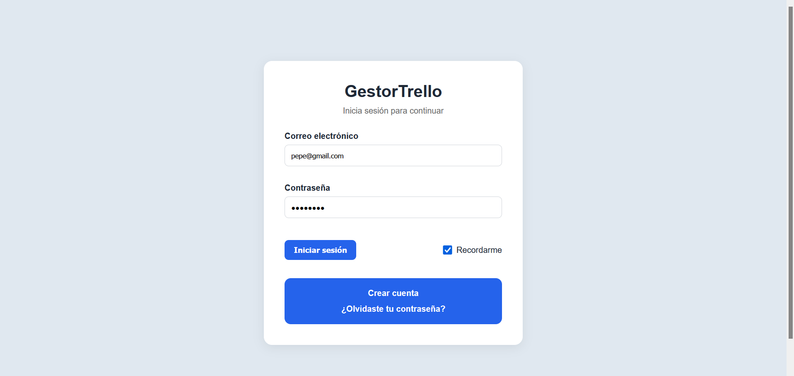

---

## Registro de usuario

> 👤 Pantalla de registro de nuevos usuarios. Permite crear una cuenta en la aplicación mediante un formulario con validaciones de datos y almacenamiento seguro de las credenciales.

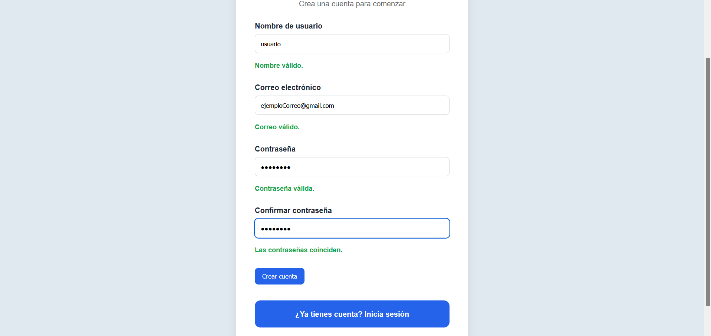

---


## Recuperación de contraseña

> 🔑 Sistema de recuperación de contraseña mediante correo electrónico. El usuario introduce su dirección de correo y recibe un enlace seguro para restablecer su contraseña y recuperar el acceso a su cuenta.

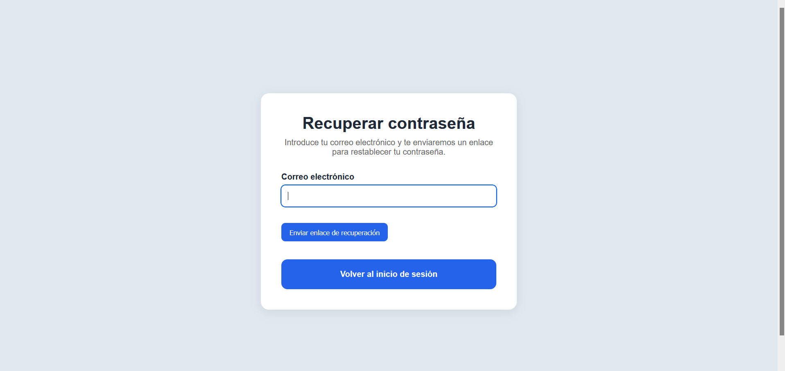
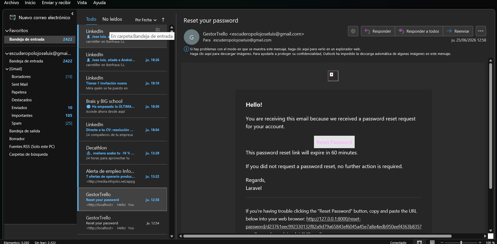

---


## Dashboard principal

> 📊 Panel principal de la aplicación que muestra un resumen de la actividad del usuario, incluyendo estadísticas de tableros, tareas y porcentaje global de progreso.

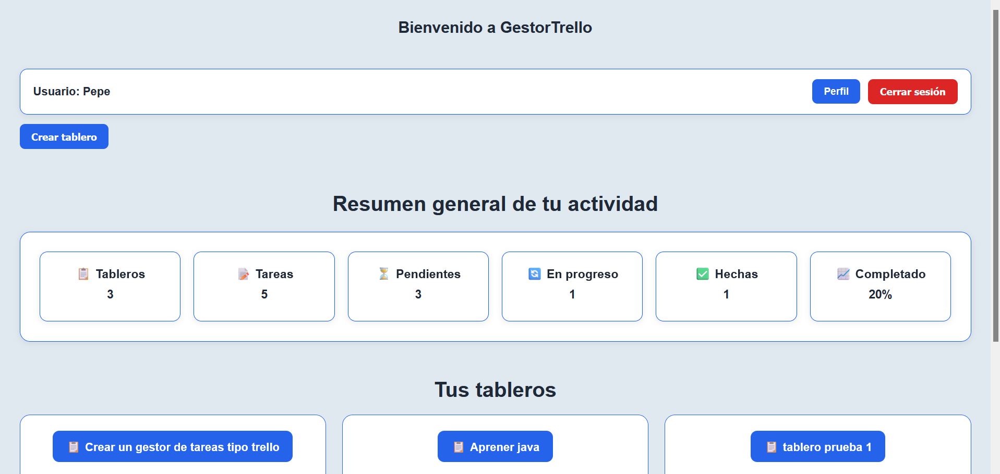
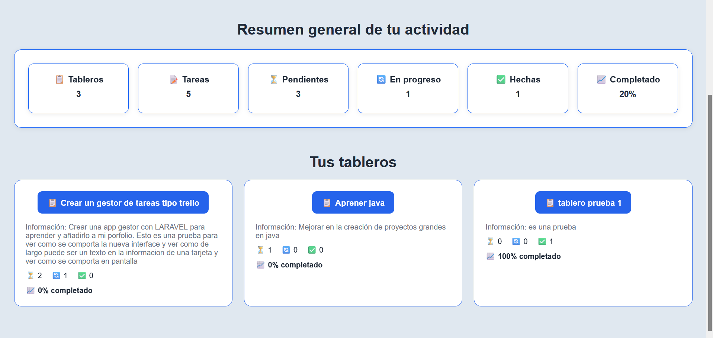

---

## Dashboard - Perfil usuario

> ⚙️ Sección de perfil personal que permite al usuario actualizar su nombre y cambiar su contraseña de forma segura desde la propia aplicación.

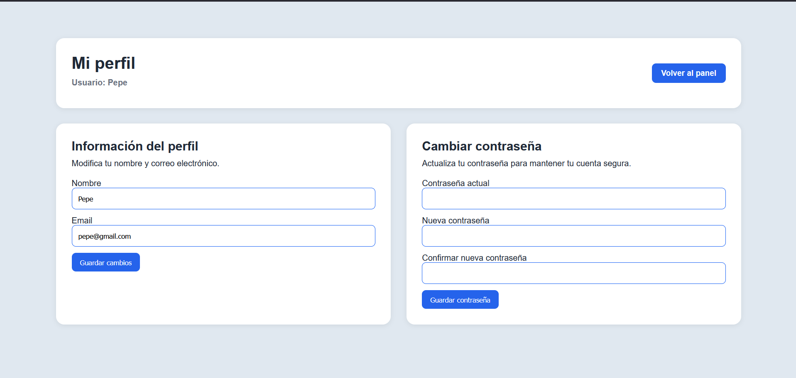

---


## Vista de un tablero

> 📋 Vista principal de un tablero. Permite organizar tareas por estados, consultar su progreso y acceder a las opciones de edición y eliminación.

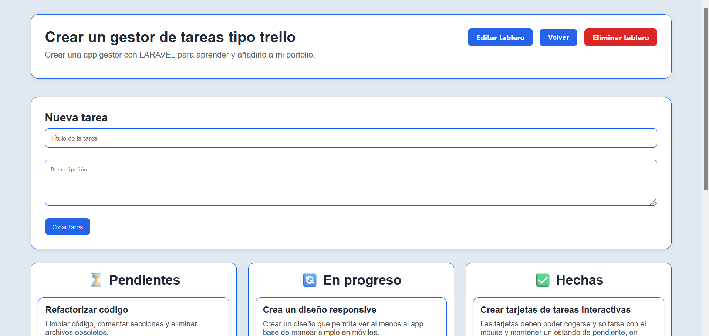
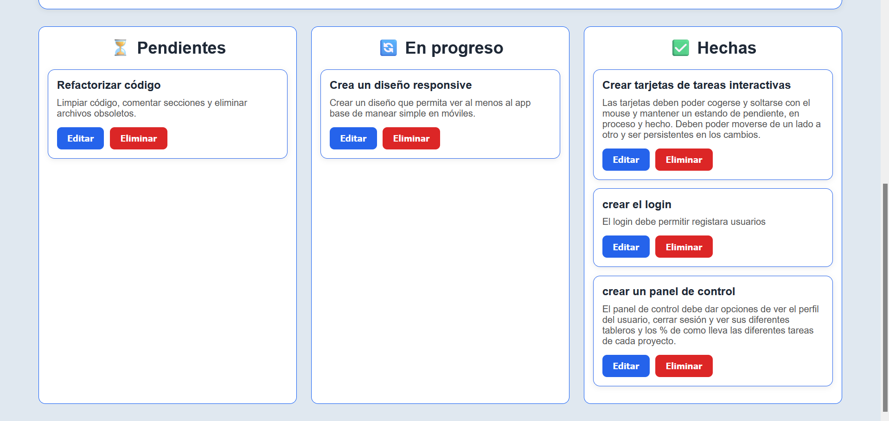

---

## Sistema Drag & Drop

> 🔄 Sistema de arrastrar y soltar que permite mover tareas entre columnas de forma intuitiva, actualizando automáticamente su estado en la base de datos.

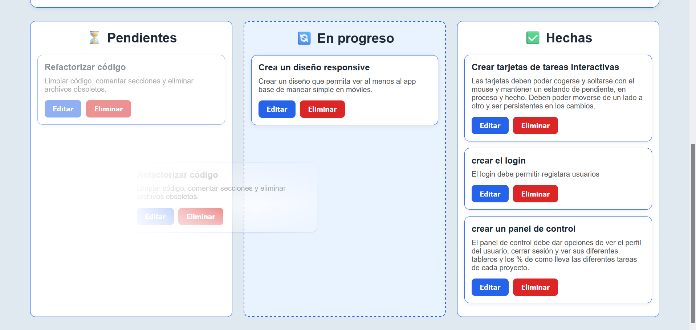

---

## 📱 Soporte para dispositivos móviles

La aplicación fue diseñada inicialmente para ser utilizada en **ordenadores de escritorio**, ya que la gestión de tareas mediante un tablero Kanban con varias columnas y tarjetas arrastrables ofrece una mejor experiencia en pantallas amplias.

No obstante, en la versión **2.0** se ha añadido un sistema **responsive** para permitir que los usuarios puedan consultar y gestionar sus proyectos desde dispositivos móviles cuando sea necesario.

Las principales adaptaciones realizadas son:

* Diseño responsive para las pantallas de autenticación, panel de control y gestión de tableros.
* Interfaces adaptadas para mejorar la navegación en pantallas pequeñas.
* Detección de la orientación del dispositivo para ofrecer la mejor experiencia de uso según la sección de la aplicación.
* Ajustes específicos para la visualización de los tableros Kanban en dispositivos móviles.

Además, se ha garantizado el correcto funcionamiento del sistema de **drag & drop** de las tarjetas, permitiendo mover tareas entre columnas tanto en escritorio como en dispositivos móviles compatibles.

> **Nota:** Aunque la aplicación puede utilizarse desde un teléfono móvil, la experiencia de usuario recomendada sigue siendo la versión de escritorio, especialmente para la gestión intensiva de tareas y el trabajo con múltiples columnas del tablero Kanban.

Version responsive vertical
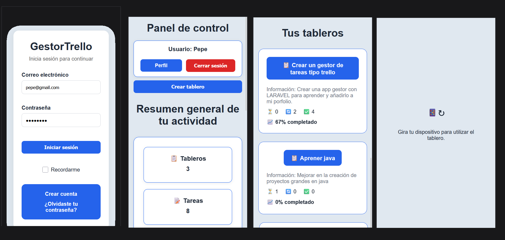

Versión responsive horizontal para las tarjetas drag & drop
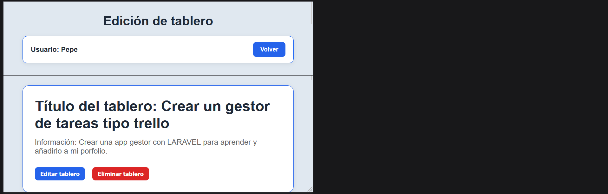
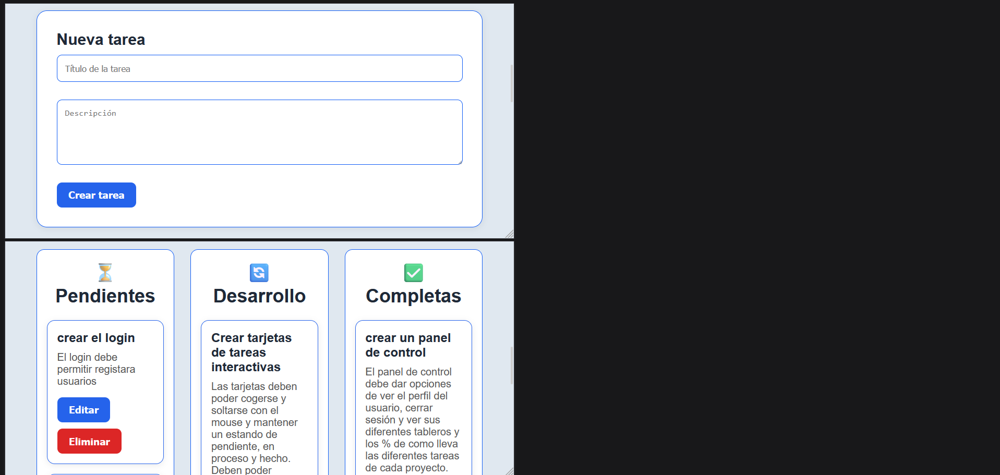

---


# ⚙️ Tecnologías utilizadas

* PHP 8.5
* Laravel 12
* Blade
* Eloquent ORM
* MySQL
* HTML5
* CSS3
* JavaScript
* Vite
* SMTP Gmail

---

# 🗂️ Estructura del proyecto

```text
app/
├── Http/
│   ├── Controllers/
│   └── Requests/

resources/
├── views/
├── css/
└── js/

routes/
database/
public/
```

---

# 🔐 Funcionalidades implementadas

## Gestión de usuarios

* Registro.
* Inicio de sesión.
* Cierre de sesión.
* Recuperación de contraseña.
* Restablecimiento mediante correo.

## Gestión de tableros

* Crear tablero.
* Editar tablero.
* Eliminar tablero.
* Ver estadísticas.

## Gestión de tareas

* Crear tarea.
* Editar tarea.
* Eliminar tarea.
* Mover tareas entre estados.

---

# 📊 Dashboard

El panel principal muestra:

* Número de tableros.
* Número total de tareas.
* Tareas pendientes.
* Tareas en progreso.
* Tareas completadas.
* Porcentaje global de finalización.

---

# 📦 Instalación

Clonar el proyecto:

```bash
git clone https://github.com/megalol-dev/gestor-trello.git
```

Entrar al proyecto:

```bash
cd gestor-trello
```

Instalar dependencias:

```bash
composer install
npm install
```

Copiar el archivo de entorno:

```bash
cp .env.example .env
```

Generar la clave:

```bash
php artisan key:generate
```

Configurar la base de datos en:

```env
DB_DATABASE=
DB_USERNAME=
DB_PASSWORD=
```

Ejecutar migraciones:

Crear la base de datos y ejecutar las migraciones:

```bash
php artisan migrate
```

Opcionalmente, si quieres datos de prueba:

```bash
php artisan db:seed
```

Iniciar el servidor:

```bash
php artisan serve
npm run dev
```

---

# 🛠️ Aspectos técnicos destacados

- Arquitectura MVC mediante Laravel.
- Uso de Eloquent ORM y relaciones entre modelos.
- Sistema de autenticación completo.
- Recuperación de contraseña mediante SMTP Gmail.
- Validaciones personalizadas.
- Componentes Blade reutilizables.
- Persistencia de estados mediante AJAX y JavaScript.
- Diseño responsive.

---

# 🚀 Estado del proyecto

✅ Proyecto finalizado y completamente funcional.

Posibles mejoras futuras:

- Compartir tableros entre usuarios.
- Etiquetas y prioridades en tareas.
- Sistema de comentarios.
- Despliegue online.

# 👨‍💻 Autor

**José Luis Escudero Polo**

* GitHub: https://github.com/megalol-dev
* Portfolio: *(añadir enlace cuando lo tengas - luego lo añado chat tranqui)*

---

# 📄 Licencia

Este proyecto ha sido desarrollado con fines educativos y como proyecto de portfolio personal. El código puede utilizarse como referencia de aprendizaje, respetando la autoría original.

